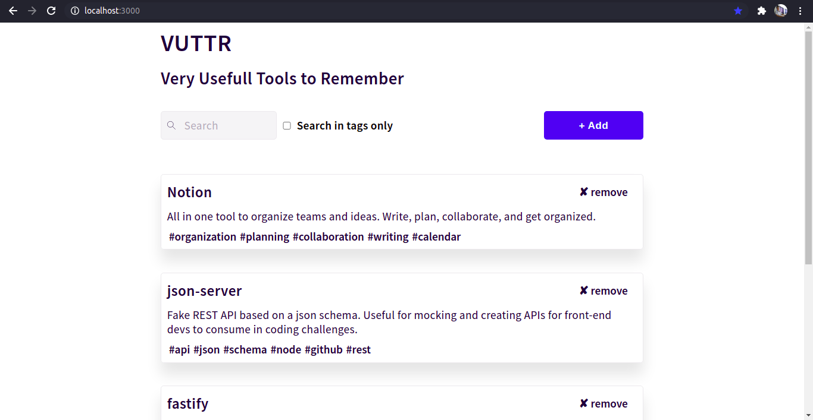

<div align="center">
    
    <h1>
        VUTTR <br />
        Very Usefull Tools To Remember
    </h1>
    <div align="center">
        
        
    </div>
</div>
<h4 align="center">
    Desafio proposto pela 
    <a href="https://bossabox.com/para-profissionais">BossaBox</a> que envolve a implementação do Front-End, baseado nessa <a href="https://gitlab.com/bossabox/challenge-fake-api/tree/master">api</a>.
    <a href="https://app.bossabox.com/profile/skills/challenges/5e3c732f75530e000797e9bd">Tente Resolver também</a>
</h4>

## Demo do Projeto
<div align="center">
    
</div>

## :rocket: Tecnlogias
- [Next.js](https://nextjs.org/)
- [json-server](https://www.npmjs.com/package/json-server)
- [axios](https://www.npmjs.com/package/axios)

## Como Começar

- Primeiro, clone o repositório:
```bash
    git clone https://github.com/Isaac-alencar/vuttr.git path/to/your/work_dir
```

- Depois execute:
```bash
    cd path/to/your/work_dir && cd server && npm run start
```

- Em outro terminal ou splited terminal:
```bash
    # caso escolha npm, remova o arquivo yarn.lock
    npm run dev
    # ou yarn se você o tiver instalado
    yarn dev
```

Abra [http://localhost:3000](http://localhost:3000) com o seu navegador e veja o resultado.
